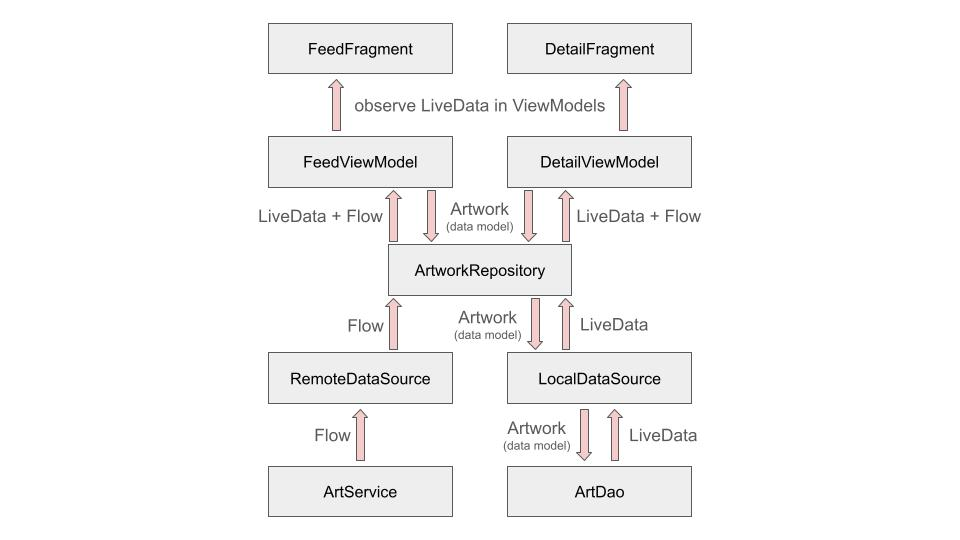

# ArtLovers 🎨

Android application that displays lists of artworks from the [Art Institute of Chicago REST API](https://api.artic.edu/docs/) via Retrofit and saves "loved" artwork to a local database using Room.

## Architecture
- Single-activity architecture using ViewPager2 and NavController to navigate between Fragments.
- MVVM pattern with Fragments that observe LiveData from ViewModels.
- Repository provides accesss to local and remote data sources.
- Dependency injection using Dagger-Hilt

Data flow chart:

## Libraries used:
- [Dagger-Hilt](https://dagger.dev/hilt/) - dependency injection
- [Retrofit](https://square.github.io/retrofit/) - REST client for Android
- [Gson](https://github.com/google/gson) - serialization/deserialization library to convert JSON
- [Room](https://developer.android.com/jetpack/androidx/releases/room) - persistence library provides an abstraction layer over SQLite
- [LiveData](https://developer.android.com/reference/androidx/lifecycle/LiveData) - observable data holder used in ViewModels
- [ViewModel](https://developer.android.com/reference/androidx/lifecycle/ViewModel) - prepares and manages data for Fragments
- [ViewPager2](https://developer.android.com/reference/androidx/viewpager2/widget/ViewPager2) - navigating between home and loved feed fragments horizontally
- [NavController](https://developer.android.com/reference/androidx/navigation/NavController) - navigating between feed and detail fragments with navigation graph
- [Picasso](https://square.github.io/picasso/) - image downloading/cacheing library